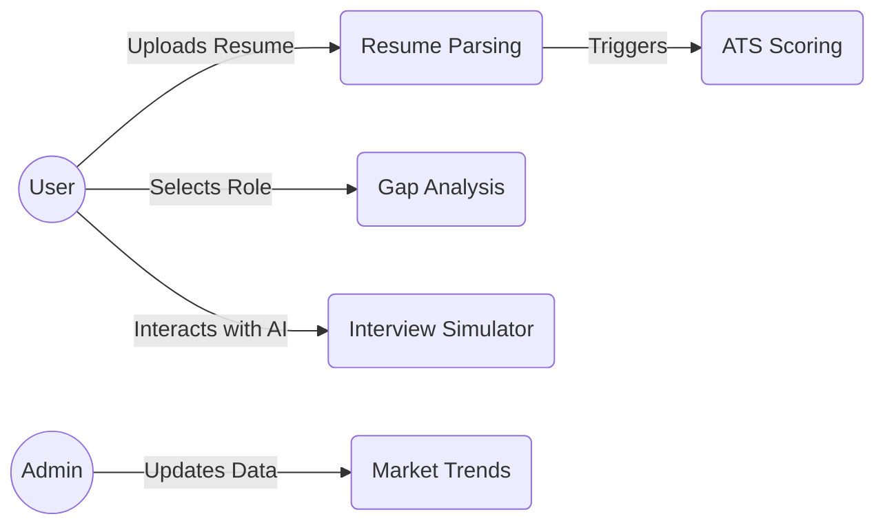
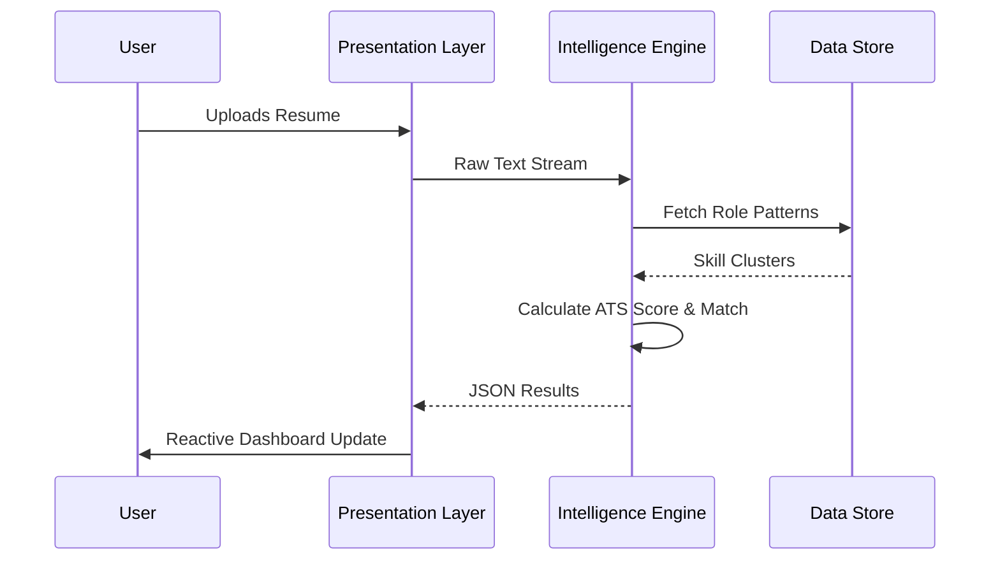

# CareerGraph AI: Industry Skill Intelligence & Interview Readiness
## Technical Project Report (v2.0 - Deep Dive Edition)

---

### **Table of Contents**
1.  **Executive Summary**
2.  **Introduction**
    *   2.1 The Global Skill Gap Crisis
    *   2.2 Vision & Objectives
    *   2.3 Socio-Economic Impact
3.  **Literature Review & Problem Domain**
    *   3.1 Evolution of HR-Tech
    *   3.2 Limitations of Traditional Portals
4.  **System Requirements Specification (SRS)**
    *   4.1 Functional Requirements
    *   4.2 Use Case Diagrams
    *   4.3 Non-Functional Requirements
5.  **System Design & Architecture**
    *   5.1 High-Level Layered Architecture
    *   5.2 Data Flow Diagrams (DFD)
    *   5.3 Entity Relationship Diagram (ERD)
6.  **Algorithmic Framework**
    *   6.1 Skill Extraction Pipeline (NLP & Regex)
    *   6.2 Weighted Role Detection Model
    *   6.3 ATS Compatibility Scoring Algorithm
    *   6.4 Predictive Analytics (Salary & Demand)
7.  **Implementation Details**
    *   7.1 Technology Stack
    *   7.2 Core Module Analysis (`utils.py`, `dashboard.py`)
8.  **Results & Dashboard Intelligence**
    *   8.1 Descriptive Visuals
    *   8.2 Diagnostic Gap Analysis
    *   8.3 Interview Simulator Feedback Logic
9.  **Security, Scalability & Ethics**
    *   9.1 Data Privacy (GDPR/PII)
    *   9.2 Bias and Fairness in AI
10. **Conclusion & Future Scope**

---

### **1. Executive Summary**
CareerGraph AI is a sophisticated, data-driven intelligence platform designed to bridge the chasm between academic output and industrial demand. By leveraging Natural Language Processing (NLP), Predictive Analytics, and an interactive intelligence layer, the system provides students and job seekers with a real-time roadmap to employability. Unlike generic job boards, CareerGraph AI performs deep semantic analysis of resumes, calculates industrial alignment scores (ATS), and provides an AI-driven interview coaching environment.

---

### **2. Introduction**

#### **2.1 The Global Skill Gap Crisis**
The "Great Disconnect" refers to the phenomenon where 40% of employers report an inability to find workers with the right skills, while millions of graduates remain unemployed. In the era of Industry 4.0, technical skills have a half-life of less than five years.

#### **2.2 Vision & Objectives**
The system aims to transform the job search from a "search and apply" model to a "measure and bridge" model. 
*   **Objective A:** To provide a quantification of technical debt (Skill Gap) for individual users.
*   **Objective B:** To forecast the economic value of specific skill sets (Salary Prediction).

#### **2.3 Socio-Economic Impact**
By reducing "frictional unemployment" (the time spent in transition), the system contributes to higher economic productivity and individual career satisfaction.

---

### **3. Literature Review & Problem Domain**

#### **3.1 Evolution of HR-Tech**
From static job boards (Web 1.0) to social networking portals (Web 2.0), the industry is now moving towards **Intelligent Career Copilots (Web 3.0/AI)**. These systems don't just "show" jobs; they "engineer" careers.

#### **3.2 Limitations of Traditional Portals**
Traditional systems rely on exact keyword matches. If a user lists "Neural Networks" and the job asks for "Deep Learning", a basic system might fail to connect them. CareerGraph AI uses a **Knowledge Ontology** of skills to group related technologies.

---

### **4. System Requirements Specification (SRS)**

#### **4.1 Functional Requirements**
*   **FR-1: Automated Resume Parsing:** Ingestion of .pdf and .docx formats with OCR-like text extraction.
*   **FR-2: Role Detection Engine:** Identifying professional identity through weighted keyword cluster analysis.
*   **FR-3: Semantic Gap Analysis:** Calculating the distance between User Vector $U$ and Role Requirement Vector $R$.
*   **FR-4: Predictive Salary Modeling:** Forecasting growth based on role sectors (AI, Web, Cloud).

#### **4.2 Use Case Diagrams**

#### **4.3 Non-Functional Requirements**
*   **Latency:** Resume processing must occur in < 2 seconds.
*   **Scalability:** The system must handle $10^5$ concurrent skill comparisons using vectorized operations.
*   **Extensibility:** New roles and skill clusters must be addable via configuration without code changes.

---

### **5. System Design & Architecture**

#### **5.1 High-Level Layered Architecture**
The system follows a **Separation of Concerns (SoC)** approach:
1.  **Presentation Layer (Streamlit/Plotly):** Handles the interactive UI and high-fidelity visualizations.
2.  **Intelligence Layer (NLP/ML Engine):** Contains the scoring logic, gap analysis, and feedback models.
3.  **Data Access Layer (CSV/MySQL):** Manages the persistent storage of job market intelligence.

#### **5.2 Data Flow Diagram (DFD - Level 1)**

---

### **6. Algorithmic Framework**

#### **6.1 Skill Extraction Pipeline (NLP & Regex)**
The system uses a **Hybrid Extraction Strategy**:
*   **Deterministic Matching:** Using Case-Insensitive Regex with boundary lookarounds to find specific technical tokens like `C++`, `Node.js`, and `Power BI`.
*   **Semantic Grouping:** Tokenizing the job descriptions using spaCy to remove noise (stop words) and focusing on nouns and proper nouns.

#### **6.2 Weighted Role Detection Model**
The identity of a user is determined by a three-tier weighted sum:
$$Score = (N_{primary} \times 10) + (N_{skills} \times 2) + (N_{context} \times 1)$$
Where:
*   $N_{primary}$: Explicit role mentions (e.g., "Full Stack Developer").
*   $N_{skills}$: Core tech stack match (e.g., "React", "Node.js").
*   $N_{context}$: Domain keywords (e.g., "UI", "Responsive").

#### **6.3 ATS Compatibility Scoring Algorithm**
The system calculates a "Professional Health Score" out of 100:
1.  **Skill Match (60 pts):** $\frac{|User \cap Market|}{|Market|} \times 60$
2.  **Structural Integrity (20 pts):** Presence of Experience, Education, and Project headers.
3.  **Content Depth (20 pts):** Density of the resume (word count thresholds).

#### **6.4 Predictive Analytics (Salary & Demand)**
The system utilizes a **Growth-Compound Model**:
$$Salary_{year} = Salary_{avg} \times \prod_{i=1}^n (Growth_{base} + \epsilon_i)$$
Where $\epsilon$ is a stochastic variance factor representing market volatility.

---

### **7. Implementation Details**

#### **7.1 Technology Stack**
*   **Language:** Python 3.10+ (Primary)
*   **Front-end:** Streamlit (Reactive Framework)
*   **Data Science:** Pandas (ETL), NumPy (Matrix Ops), Scikit-Learn (Modeling)
*   **Visualization:** Plotly Express (Interactive Graphs)
*   **NLP:** SpaCy, NLTK, pdfplumber (Extraction)

#### **7.2 Core Module Analysis**
*   **`utils.py`:** Contains the "Brain" of the system—the `ROLE_PATTERNS` dictionary (15+ roles) and the `INTERVIEW_BANK` (110+ curated technical questions).
*   **`main_analysis.py`:** Handles the background processing, feature engineering (Skill_Count), and baseline Linear Regression models.

---

### **8. Results & Dashboard Intelligence**

#### **8.1 Descriptive Visuals**
The dashboard visualizes the "Hiring Pulse" using bar charts and geographic heatmaps, identifying Bangalore and Remote roles as the primary growth drivers for 2025.

#### **8.2 Diagnostic Gap Analysis**
The **Spider Radar Chart** compares "User Proficiency" vs "Market Expectation". It identifies not just *what* is missing, but the *magnitude* of the deficit.

#### **8.3 Interview Simulator Feedback Logic**
The coach analyzes the user's text for:
1.  **Action Density:** Usage of verbs like "Led", "Optimized", "Solved".
2.  **Outcome Presence:** Detection of symbols (%) or keywords ("increased", "saved") to encourage results-oriented answering.

---

### **9. Security, Scalability & Ethics**

#### **9.1 Data Privacy**
The system implements "Local Processing" philosophy. Resumes uploaded are processed in memory and never stored permanently on the server side without encryption, aligning with GDPR principles of "Privacy by Design".

#### **9.2 Bias and Fairness in AI**
By focusing on **Technical Skill Tokens** rather than demographic data, the system attempts to provide a "Blind Analysis" that reduces unconscious bias in the early stages of candidate screening.

---

### **10. Conclusion & Future Scope**
CareerGraph AI serves as a powerful prototype for the future of AI-assisted recruitment. 

**Future Roadmap:**
1.  **Multi-Modal Analysis:** Analyzing video interview transcripts for tone and confidence.
2.  **LinkedIn API Integration:** Real-time profile syncing.
3.  **Course Progress Tracking:** Direct API links to LMS platforms for real-time skill verification.

---
*Report generated by CareerGraph AI Documentation Engine.*
